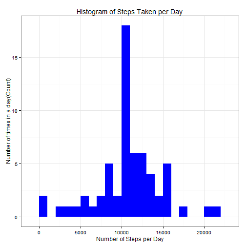

```r
echo = TRUE
library(knitr)
library(ggplot2)
```
## Loading and preprocessing the data
1. Load the data

```r
data <- read.table(unz("activity.zip", "activity.csv"), header=T, quote="\"", sep=",")
```
2. Process/transform the data (if necessary) into a format suitable for your analysis

```r
data$date <- as.Date(data$date, format = "%Y-%m-%d")
data$interval <- as.factor(data$interval)
steps_per_day <- aggregate(steps ~ date,data, sum)
colnames(steps_per_day) <- c("date","steps")
head(steps_per_day)
```

```
##         date steps
## 1 2012-10-02   126
## 2 2012-10-03 11352
## 3 2012-10-04 12116
## 4 2012-10-05 13294
## 5 2012-10-06 15420
## 6 2012-10-07 11015
```
## What is mean total number of steps taken per day?
1. Make a histogram of the total number of steps taken each day


```r
hist(steps_per_day$steps, breaks = 25, main = "Histogram of Total Steps per Day")
```

 

2. Calculate and report the mean and median total number of steps taken per day


```r
steps_mean   <- mean(steps_per_day$steps, na.rm=TRUE)
steps_mean
```

```
## [1] 10766.19
```


```r
steps_median <- median(steps_per_day$steps, na.rm=TRUE)
steps_median
```

```
## [1] 10765
```

## What is the average daily activity pattern?

1. Make a time series plot (i.e. type = "l") of the 5-minute interval (x-axis) and the average number of steps taken, averaged across all days (y-axis)

```r
steps_per_interval <- aggregate(data$steps, 
                                by = list(interval = data$interval),
                                FUN=mean, na.rm=TRUE)
```


```r
steps_per_interval$interval <- 
        as.integer(levels(steps_per_interval$interval)[steps_per_interval$interval])
colnames(steps_per_interval) <- c("interval", "steps")
ggplot(steps_per_interval, aes(x=interval, y=steps)) +   
        geom_line(color="black", size=1) +  
        labs(title="Average Daily Activity Pattern", x="5-minute interval", y="average number of steps") +  
        theme_bw()
```

 


2. Which 5-minute interval, on average across all the days in the dataset, contains the maximum number of steps?

```r
max_interval <- steps_per_interval[which.max(  
        steps_per_interval$steps),]
```
The **835<sup>th</sup>** interval has maximum **206** steps.

## Imputing missing values
1. Calculate and report the total number of missing values in the dataset (i.e. the total number of rows with NAs)

```r
missing_vals <- sum(is.na(data$steps))
```
The total number of ***missing values*** are **2304**.

2. Strategy for filling in all of the missing values in the dataset
To fill in the missing values, I choose to replace them with the mean value at the same interval across days.
3. Create a new dataset that is equal to the original dataset but with the missing data filled in.

```r
na_fill <- function(data, pervalue) {
        na_index <- which(is.na(data$steps))
        na_replace <- unlist(lapply(na_index, FUN=function(idx){
                interval = data[idx,]$interval
                pervalue[pervalue$interval == interval,]$steps
        }))
        fill_steps <- data$steps
        fill_steps[na_index] <- na_replace
        fill_steps
}

data_fill <- data.frame(  
        steps = na_fill(data, steps_per_interval),  
        date = data$date,  
        interval = data$interval)
```
4. Histogram of the total number of steps taken each day and Calculate and report the mean and median total number of steps taken per day

```r
fill_steps_per_day <- aggregate(steps ~ date, data_fill, sum)
colnames(fill_steps_per_day) <- c("date","steps")

ggplot(fill_steps_per_day, aes(x = steps)) + 
       geom_histogram(fill = "blue", binwidth = 1000) + 
        labs(title="Histogram of Steps Taken per Day", 
             x = "Number of Steps per Day", y = "Number of times in a day(Count)") + theme_bw()
```

 

```r
filled_steps_mean <- round(mean(fill_steps_per_day$steps), 2)
filled_steps_mean
```

```
## [1] 10766.19
```

```r
filled_steps_median <- round(median(fill_steps_per_day$steps), 2)
filled_steps_median
```

```
## [1] 10766.19
```

Do these values differ from the estimates from the first part of the assignment?

Yes, the values differ slightly

What is the impact of imputing missing data on the estimates of the total daily number of steps?

The mean and median are equal


## Are there differences in activity patterns between weekdays and weekends?

1. Create a new factor variable in the dataset with two levels -- "weekday" and "weekend" indicating whether a given date is a weekday or weekend day.


```r
head(data_fill)
```

```
##       steps       date interval
## 1 1.7169811 2012-10-01        0
## 2 0.3396226 2012-10-01        5
## 3 0.1320755 2012-10-01       10
## 4 0.1509434 2012-10-01       15
## 5 0.0754717 2012-10-01       20
## 6 2.0943396 2012-10-01       25
```

```r
data_fill$weekdays <- factor(format(data_fill$date, "%A"))
levels(data_fill$weekdays)
```

```
## [1] "Friday"    "Monday"    "Saturday"  "Sunday"    "Thursday"  "Tuesday"  
## [7] "Wednesday"
```

```r
levels(data_fill$weekdays) <- list(weekday = c("Monday", "Tuesday","Wednesday","Thursday", "Friday"),weekend = c("Saturday", "Sunday"))
levels(data_fill$weekdays)
```

```
## [1] "weekday" "weekend"
```

```r
table(data_fill$weekdays)
```

```
## 
## weekday weekend 
##   12960    4608
```

2. Make a panel plot containing a time series plot (i.e. type = "l") of the 5-minute interval (x-axis) and the average number of steps taken, averaged across all weekday days or weekend days (y-axis)

```r
avgSteps <- aggregate(data_fill$steps, 
                      list(interval = as.numeric(as.character(data_fill$interval)), 
                           weekdays = data_fill$weekdays),
                      FUN = "mean")
names(avgSteps)[3] <- "meanOfSteps"
library(lattice)
xyplot(avgSteps$meanOfSteps ~ avgSteps$interval | avgSteps$weekdays, 
       layout = c(1, 2), type = "l", 
       xlab = "Interval", ylab = "Number of steps")
```

 


